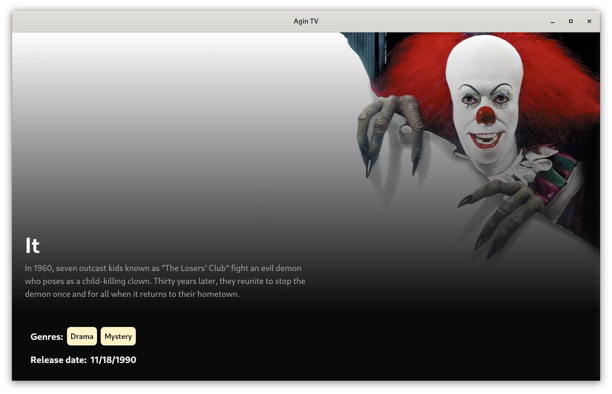

# Agin TV

Discover all kinds of Horror movies and series.

This is a desktop application built with Tauri that allows users to browse and search for horror movies and series. It uses OIDC for authentication and fetches data from TMDB.



## Demo video:

[](https://youtu.be/fgudVgl1VRA)


## Features
- OIDC login with authentik(you can use different provider if you want, it really doesn't matter).
- OIDC PKCE flow, because desktop apps can't keep a secret.
- Browse a wide selection of horror movies and series.
- Read information about those movies and series.
- Search for specific titles.
- Data from TMDB.
- User-friendly interface (i hope so at least).

## Technologies:
- [Tauri](https://tauri.app/) - for building the desktop application.

## Docs:

You can find the api docs [here](https://tvapi.agin.rocks/apidoc/scalar).

## Hosting api with docker:

### Dependencies:

- [Docker](https://docs.docker.com/get-docker/)

### Steps:

1. Clone the repository:
   ```bash
   git clone https://github.com/aginrocks/agin-tv.git
   cd agin-tv
   ```

2. You need to fill out the `config.toml` and `.env` files with proper values.

   For oidc provider you can use [google](https://developers.google.com/identity/openid-connect/openid-connect) if you don't have self hosted authentik.

   Create `.env` file in root repository folder with content like this:

  ```
  TMDB_API_KEY=your key here
  ```

  and config.toml file with content like this:

  ```toml
  [general]
  listen_address = [
      "0.0.0.0:42069",
      "[::]:42069",
  ]
  public_url = "http://localhost:42069/"

  [db]
  connection_string = "mongodb://mongodb:27017" //here 'mongodb' is the name of the docker service
  database_name = "agin-tv"

  [oidc]
  issuer = "oidc issuer url like google or authentik"
  client_id = "cliend id"

  [redis]
  connection_string = "redis://valkey:6379" //here 'valkey' is the name of the docker service

  ```

3. Start docker:
   ```bash
   dc up -d
   ```

## Building and Running in developement evironment:

### Dependencies:

- [Rust](https://rustup.rs)
- [Docker](https://docs.docker.com/get-docker/)
- [pnpm](https://pnpm.io/installation)

### Steps:

1. Clone the repository:
   ```bash
   git clone https://github.com/aginrocks/agin-tv.git
   cd agin-tv
   ```

2. Start docker with walkey and mongodb:
   ```bash
   dc -f compose-dev.yaml up -d
   ```

3. Build and run api server:
   ```bash
   cd api
   cargo run
   ```
   At this point the api should panic. You need to fill out the `config.toml` file with proper values. And restart the server.

   For oidc provider you can use [google](https://developers.google.com/identity/openid-connect/openid-connect) if you don't have self hosted authentik.

   Look at docker instructions for example config files.


4. Build and run desktop application:

  Api adress is set in `desktop/src-tauri/src/helpers.rs` and `desktop/src/config.ts` you might want to change it.

  Before building the desktop app, ensure you have the [necessary dependencies for tauri](https://v2.tauri.app/start/prerequisites/) installed.

   Open another terminal window and run:
   ```bash
   cd desktop
   pnpm tauri dev
   ```
